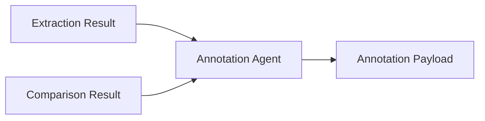

# Annotation Agent

The annotation agent converts extraction and comparison outputs into document-level annotations.

## Examples

- Highlight changed clauses.
- Add comments to risky terms.
- Link extracted fields to source pages.
- Produce annotation payloads for a UI or document renderer.

## Output contract

Each annotation should include:

- Target document
- Page or chunk reference
- Label
- Comment
- Severity or category
- Evidence quote

