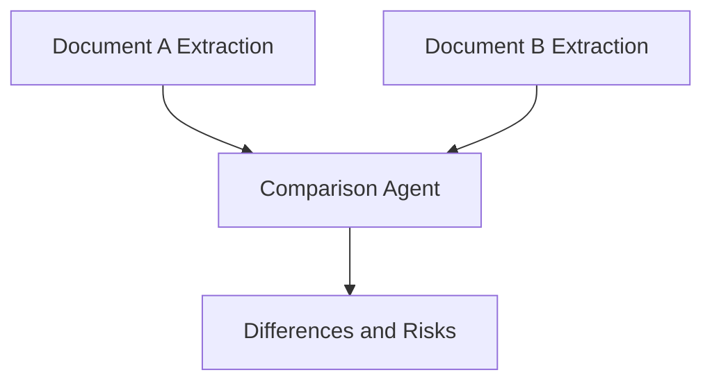

# Comparison Agent

The comparison agent compares structured extraction outputs or targeted evidence from two or more documents.

## Preferred flow

## Responsibilities

- Compare field values.
- Identify missing clauses or changed terms.
- Highlight risk changes.
- Produce structured differences.

## When to use a separate agent

Use a comparison agent when the comparison requires reasoning, tool usage, verification, scoring, or explanation. For simple field-by-field comparison, a deterministic function may be enough.
