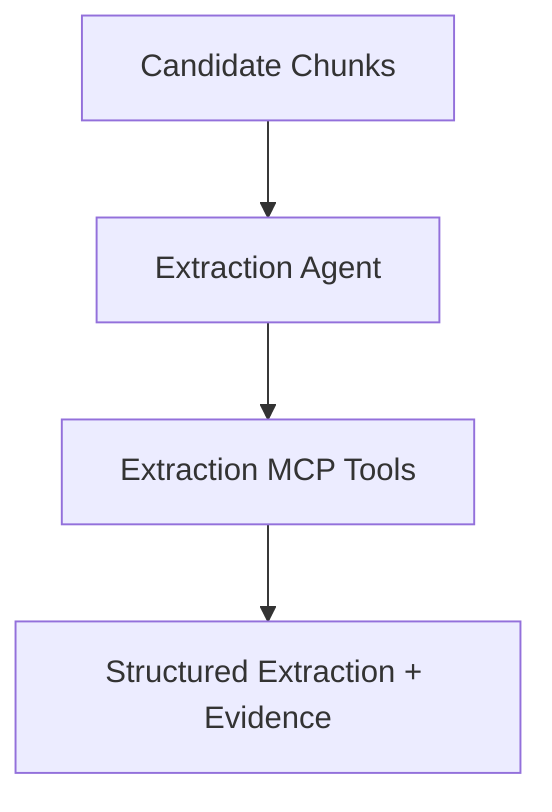

# Extraction Agent

The extraction agent extracts structured elements from relevant document chunks.

## Input

- Task definition
- Candidate chunks
- Document metadata
- Expected schema

## Output

- Structured JSON
- Missing fields
- Evidence references
- Confidence scores
- Warnings

## Best practice

Do not pass the full long document to extraction skills by default. Retrieve focused chunks and neighboring chunks first.

