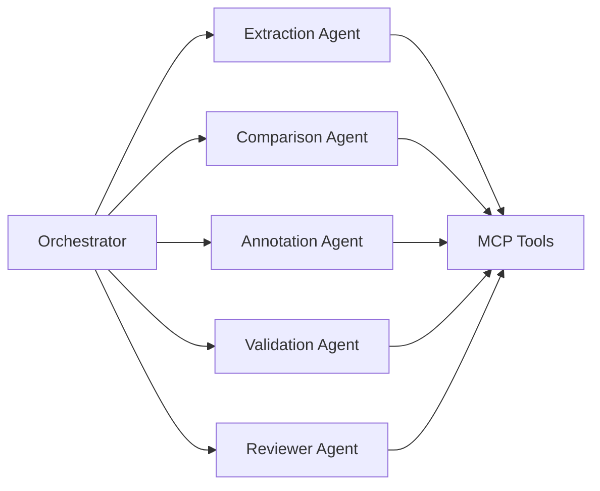

# Agents Overview

The platform uses one orchestrator and several specialist agents.

## Design principle

Specialist agents should receive only the tools relevant to their job. This reduces token usage, improves tool selection, and makes behavior easier to test.

## Recommended agents

- Extraction Agent
- Comparison Agent
- Annotation Agent
- Validation Agent
- Reviewer Agent
- Report Generation Agent
