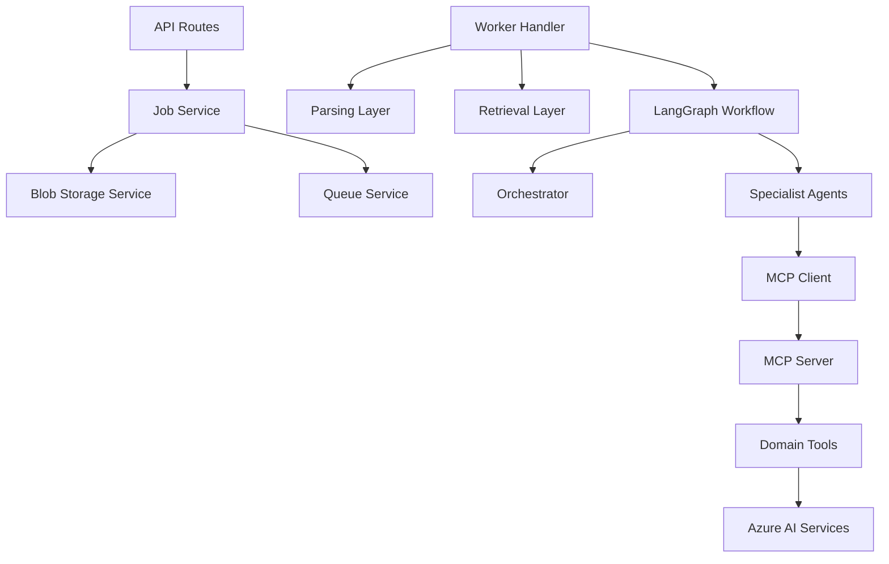

# C4 Component

The component view describes the main internal modules.

## Component boundaries

- API modules should not contain extraction logic.
- Worker modules should not expose public endpoints.
- Agents should not directly call cloud services.
- MCP tools should hide service-specific implementation details.
- Schemas define the contracts between layers.
