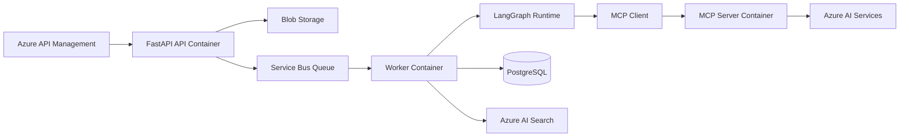

# C4 Container

The container view separates runtime responsibilities.

## API container

Receives requests, authenticates callers, validates input, uploads documents, creates job records, and enqueues work.

## Worker container

Consumes jobs, runs LangGraph workflows, persists results, and coordinates with MCP tools.

## MCP server container

Hosts reusable tools grouped by domain. It is internal-only and not exposed to the public internet.
