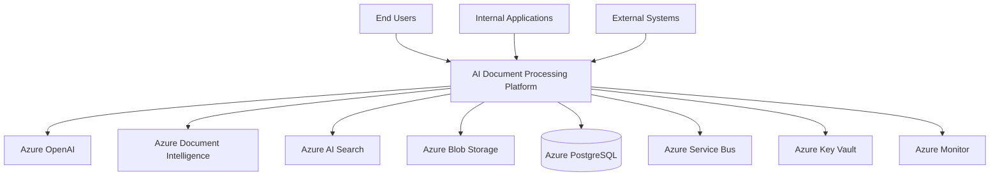

# C4 Context

The context view explains how the platform fits into the wider enterprise environment.

## Responsibilities

The platform owns document workflow execution, agent orchestration, MCP tool invocation, and persistence of results. Azure managed services provide AI, storage, messaging, secrets, and observability capabilities.
