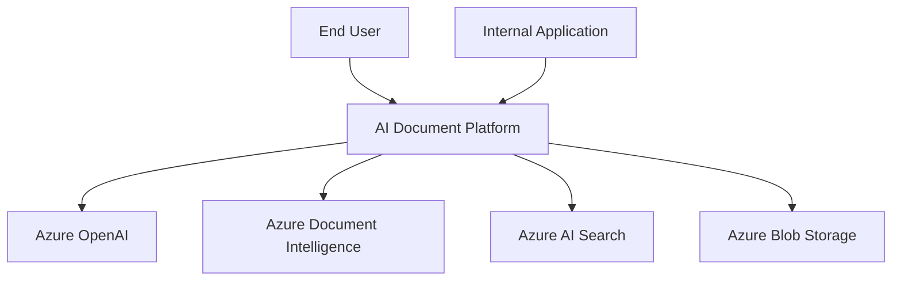
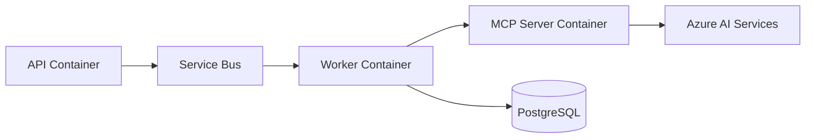

# C4 Architecture

## Context

```mermaid
flowchart TB
    User[End User] --> Platform[AI Document Platform]
    App[Internal Application] --> Platform
    Platform --> AzureOpenAI[Azure OpenAI]
    Platform --> DocIntel[Azure Document Intelligence]
    Platform --> Search[Azure AI Search]
    Platform --> Storage[Azure Blob Storage]
```

## Container

```mermaid
flowchart LR
    API[API Container] --> Queue[Service Bus]
    Queue --> Worker[Worker Container]
    Worker --> MCP[MCP Server Container]
    Worker --> DB[(PostgreSQL)]
    MCP --> AzureAI[Azure AI Services]
```
