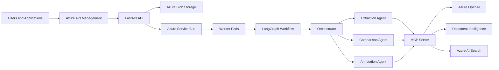

# Architecture Overview

The platform processes long documents asynchronously and delegates AI work to specialist agents.

```mermaid
flowchart LR
    U[Users and Applications] --> APIM[Azure API Management]
    APIM --> API[FastAPI API]
    API --> BLOB[Azure Blob Storage]
    API --> BUS[Azure Service Bus]
    BUS --> W[Worker Pods]
    W --> LG[LangGraph Workflow]
    LG --> O[Orchestrator]
    O --> EA[Extraction Agent]
    O --> CA[Comparison Agent]
    O --> AA[Annotation Agent]
    EA --> MCP[MCP Server]
    CA --> MCP
    AA --> MCP
    MCP --> AOAI[Azure OpenAI]
    MCP --> DI[Document Intelligence]
    MCP --> SEARCH[Azure AI Search]
```

Core rule: agents invoke MCP tools; MCP tools invoke Azure services.
