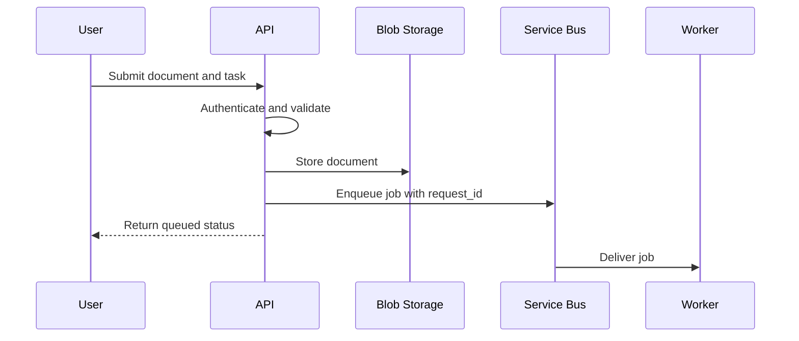
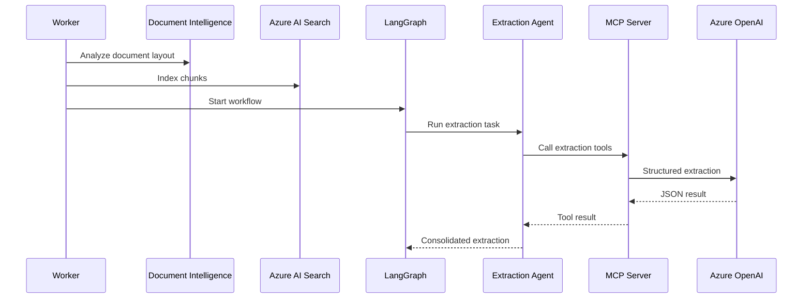
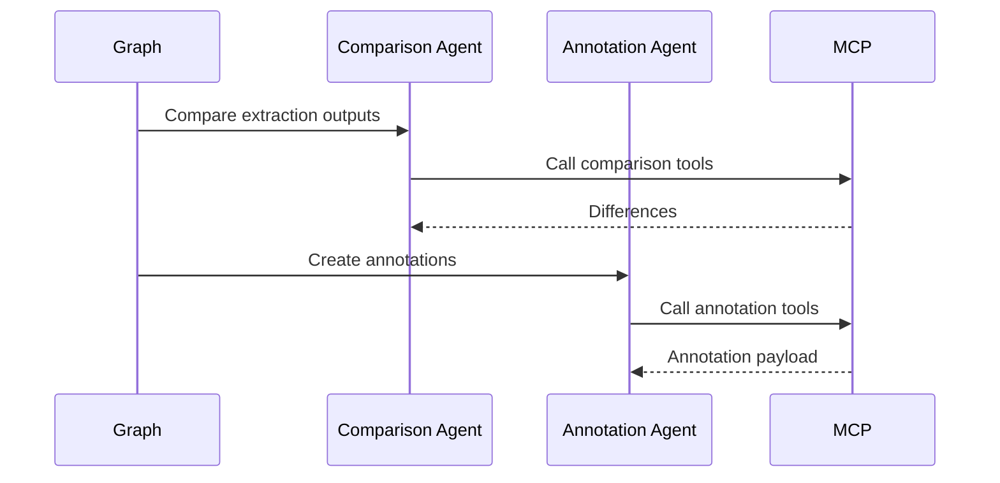

# Sequence Diagrams

## Document ingestion

```mermaid
sequenceDiagram
    participant User
    participant API
    participant Blob as Blob Storage
    participant Bus as Service Bus
    participant Worker

    User->>API: Submit document and task
    API->>API: Authenticate and validate
    API->>Blob: Store document
    API->>Bus: Enqueue job with request_id
    API-->>User: Return queued status
    Bus->>Worker: Deliver job
```

## Extraction workflow

```mermaid
sequenceDiagram
    participant Worker
    participant DI as Document Intelligence
    participant Search as Azure AI Search
    participant Graph as LangGraph
    participant Agent as Extraction Agent
    participant MCP as MCP Server
    participant AOAI as Azure OpenAI

    Worker->>DI: Analyze document layout
    Worker->>Search: Index chunks
    Worker->>Graph: Start workflow
    Graph->>Agent: Run extraction task
    Agent->>MCP: Call extraction tools
    MCP->>AOAI: Structured extraction
    AOAI-->>MCP: JSON result
    MCP-->>Agent: Tool result
    Agent-->>Graph: Consolidated extraction
```

## Comparison and annotation

```mermaid
sequenceDiagram
    participant Graph
    participant C as Comparison Agent
    participant A as Annotation Agent
    participant MCP

    Graph->>C: Compare extraction outputs
    C->>MCP: Call comparison tools
    MCP-->>C: Differences
    Graph->>A: Create annotations
    A->>MCP: Call annotation tools
    MCP-->>A: Annotation payload
```
