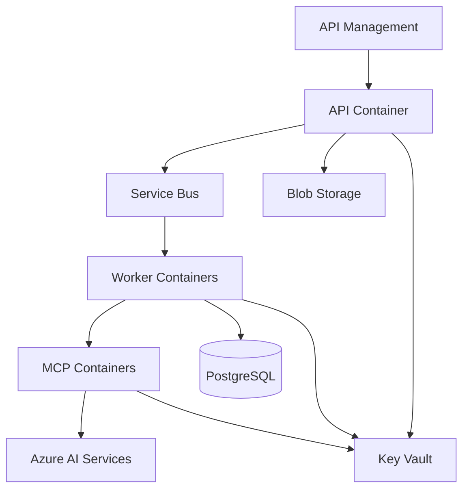

# Azure Overview

Azure provides the managed infrastructure for compute, AI, messaging, storage, security, and observability.

## Core services

- Azure API Management for public API governance.
- AKS or Azure Container Apps for API, worker, and MCP containers.
- Azure Blob Storage for raw and generated documents.
- Azure Service Bus for durable asynchronous jobs.
- Azure AI Search for chunk and vector retrieval.
- Azure Document Intelligence for layout, OCR, tables, and page structure.
- Azure OpenAI for reasoning, extraction, comparison, and annotation.
- Azure PostgreSQL for metadata, results, audit history, and workflow state.
- Azure Cache for Redis for cache, temporary state, and rate limiting.
- Azure Key Vault for secrets and certificates.
- Azure Monitor and Application Insights for observability.

## Preferred production split

