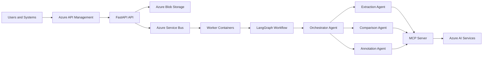

# Enterprise AI Document Platform

This documentation site describes the reference architecture and implementation approach for a scalable Azure multi-agent document processing platform.

The platform is designed around five ideas:

1. Documents are processed asynchronously.
2. Long documents are parsed, normalized, chunked, and retrieved before extraction.
3. An orchestrator plans the workflow but does not perform extraction itself.
4. Specialist agents execute focused tasks using small toolsets.
5. MCP servers expose reusable tools that call Azure AI services.

## Main architecture

## Repository areas

- `app/`: reference implementation code
- `docs/`: architecture handbook
- `kubernetes/`: deployment templates
- `.github/workflows/`: CI pipeline
- `Dockerfile.*`: container definitions
