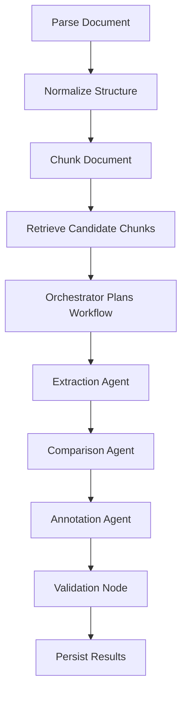

# LangGraph Workflow

LangGraph is the workflow execution engine for document processing.

## Standard workflow

## Why LangGraph

LangGraph gives the platform explicit state, deterministic workflow edges, conditional routing, and a clean place to handle retries, validation, and future human-in-the-loop steps.

## State model

The graph state should include request identifiers, document identifiers, chunks, candidate chunks, plan, intermediate agent results, validation output, and errors.
