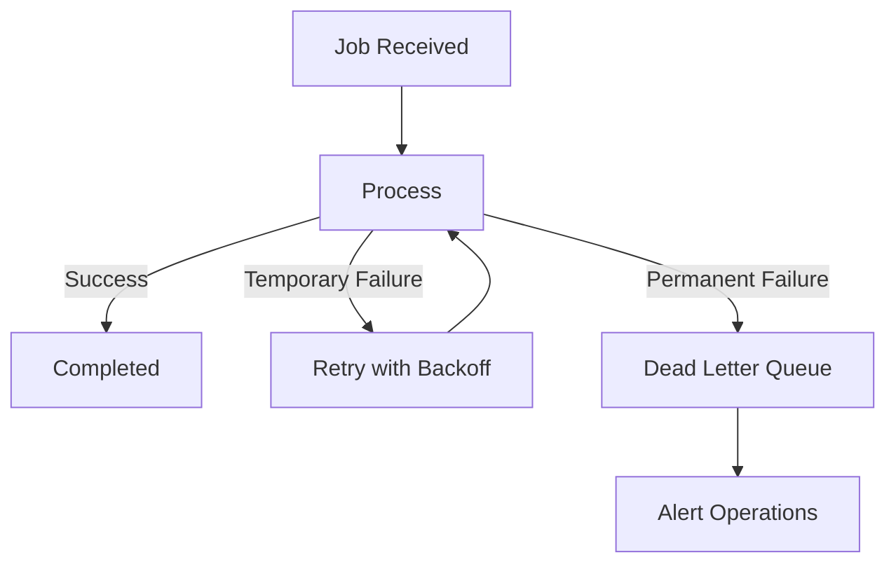

# Failure Handling

Document processing workflows must be resilient because they involve long-running tasks, external services, and LLM calls.

## Required mechanisms

- Request IDs and idempotency keys.
- Retry policies with exponential backoff.
- Dead-letter queues for failed Service Bus messages.
- Timeouts around LLM, MCP, and Azure service calls.
- Circuit breakers for unstable dependencies.
- Partial-result persistence.
- Clear user-facing status transitions.

## Status model

Recommended statuses:

- queued
- processing
- waiting_for_dependency
- completed
- completed_with_warnings
- failed
- cancelled

## Failure flow

